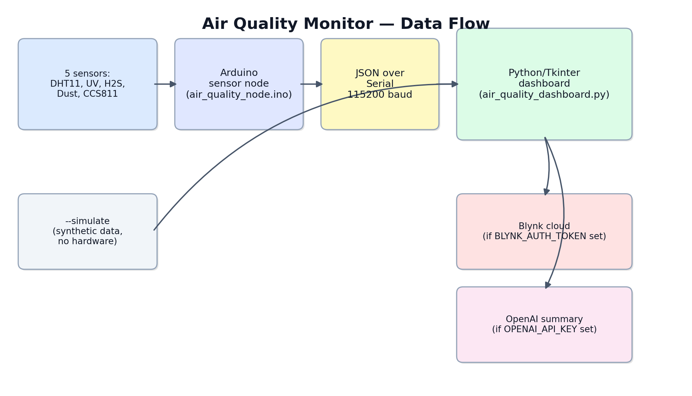

<div align="center">

# 🌬️ Air Quality Monitor

### 7-Sensor Environmental Bench — Serial JSON, Optional Cloud Upload, Optional AI Summaries


[](LICENSE)
[](https://github.com/eahmeddarwish/air-quality-monitor)


**Built by [Ahmed Darwish](mailto:eahmeddarwish@gmail.com)**

[📖 Documentation](#-architecture--معمارية-المشروع) · [⚠️ Honest Limitations](#-honest-limitations--محدوديات-صادقة) · [⭐ Star on GitHub](https://github.com/eahmeddarwish/air-quality-monitor)

</div>



---

## 🌍 Overview | نظرة عامة

**[English]**
A 7-sensor environmental monitoring bench: temperature, humidity, UV
intensity, dust density, CO₂, TVOC, and H₂S — read by an Arduino sensor
node and streamed as JSON over Serial to a Python/Tkinter dashboard. The
dashboard can optionally push readings to a Blynk cloud dashboard and ask
an LLM for a short plain-language environmental summary every few minutes.

This is a consolidation of an earlier prototype that had grown into roughly
15 near-duplicate scripts — one script per feature combination (DHT-only,
+Blynk, +UV, +ThingSpeak, +OpenAI, and so on). Here, every one of those
combinations is a runtime feature flag on one script, not a separate file.
See [Technical decisions](#-technical-decisions--قرارات-تقنية) below.

**[العربية]**
منصّة مراقبةٍ بيئية بسبعة مستشعرات: درجة الحرارة، الرطوبة، شدة الأشعة فوق
البنفسجية، كثافة الغبار، ثاني أكسيد الكربون، المركبات العضوية المتطايرة،
وكبريتيد الهيدروجين — تُقرأ عبر عقدة استشعارٍ من Arduino وتُبَث بصيغة JSON
عبر المنفذ التسلسلي إلى لوحة تحكمٍ Python/Tkinter. يمكن للوحة رفع القراءات
اختياريًا إلى لوحة Blynk السحابية، وطلب ملخصٍ بيئيٍّ قصيرٍ بلغةٍ طبيعيةٍ من
نموذج ذكاءٍ اصطناعي كل بضع دقائق.

هذا تجميعٌ لنموذجٍ أوّليٍّ سابق كان قد تضخّم إلى نحو 15 سكربتًا شبه مكرر —
سكربتٌ لكل توليفة ميزات (DHT فقط، +Blynk، +UV، +ThingSpeak، +OpenAI، إلخ).
هنا، كل توليفةٍ من هذه ميزةٌ تُفعَّل وقت التشغيل في سكربتٍ واحد، لا ملفٍّ
منفصل. راجع [القرارات التقنية](#-technical-decisions--قرارات-تقنية) أدناه.

---

## ✨ Key Features | المميزات

| Feature | Details |
|---|---|
| 🌡️ **7-Sensor Bench** | Temperature, humidity, UV, dust, CO₂ (eq.), TVOC, H₂S — one Arduino sensor node |
| 🔌 **Serial JSON Streaming** | Sensor node streams structured JSON — no proprietary protocol to reverse-engineer |
| 🖥️ **Bilingual Desktop Dashboard** | Python/Tkinter GUI rendering both English and Arabic (`python-bidi` + `arabic-reshaper`) |
| ☁️ **Optional Blynk Upload** | Push live readings to a Blynk cloud dashboard — silently disabled if no token is set |
| 🤖 **Optional AI Summary** | Ask an LLM (OpenAI) for a short plain-language environmental summary every few minutes |
| 🎮 **Hardware-Free `--simulate`** | Exercise the full dashboard, Blynk upload, and AI analysis without any Arduino attached |
| 🧩 **One Script, Feature Flags** | Consolidated from ~15 near-duplicate prototype scripts into one script with runtime feature flags |

---

## 🏗️ Architecture | معمارية المشروع

🎨 [View/edit the diagram on Lucidchart](https://lucid.app/lucidchart/c8f645ee-ee62-42a6-896e-6c5122c2271b/edit)

```
 7 sensors (Arduino)              Serial (JSON)             Python / Tkinter
┌───────────────────┐                                    ┌─────────────────────────┐
│ DHT11 · UV · H2S   │  ───────────────────────────────►  │ air_quality_dashboard.py │
│ Dust · CCS811       │                                    │  ├─ Blynk upload (opt)  │──► Blynk Cloud
└───────────────────┘                                    │  └─ AI summary (opt)    │──► OpenAI API
                                                            └─────────────────────────┘
                        --simulate flag replaces the Arduino with synthetic readings
                                   on the exact same code path
```

| Run Mode | Command | Notes |
|---|---|---|
| Real hardware | `python app/air_quality_dashboard.py` | Reads live sensor data over Serial |
| Simulation | `python app/air_quality_dashboard.py --simulate` | No hardware needed — synthetic readings |

---

## 🔧 Hardware & Wiring | العتاد والتوصيل

**[English]**

| Sensor | Metric | Pin | Notes |
|---|---|---|---|
| DHT11 | Temperature, humidity | Digital 2 | |
| Analog UV sensor | UV intensity | A0 | ML8511-class, factory-calibrated ADC scale factor |
| H2S gas sensor | H₂S (ppm) | A2 | Analog range mapped linearly, approximate |
| Dust sensor (Sharp-style) | Dust density | A1 (+ LED pin 7) | GP2Y1010AU0F-class, datasheet pulse timing |
| Adafruit CCS811 | eCO₂ (ppm), TVOC (ppb) | I2C (SDA/SCL) | |

**[العربية]**

| المستشعر | المقياس | البين | ملاحظات |
|---|---|---|---|
| DHT11 | درجة الحرارة والرطوبة | رقمي 2 | |
| مستشعر UV تناظري | شدة الأشعة فوق البنفسجية | A0 | من فئة ML8511، معامل تحويل مُعايَر مصنعيًا |
| مستشعر غاز H2S | كبريتيد الهيدروجين (ppm) | A2 | تحويلٌ خطيٌّ تقريبي للمدى التناظري |
| مستشعر الغبار (طراز Sharp) | كثافة الغبار | A1 (+ LED على البين 7) | من فئة GP2Y1010AU0F، توقيتٌ حسب ورقة البيانات |
| Adafruit CCS811 | ثاني أكسيد الكربون المكافئ وTVOC | I2C (SDA/SCL) | |

---

## 🛠️ Technical decisions | قرارات تقنية

**[English]**

**Real secrets were found hardcoded in the original prototype, and are gone
from this version.** An earlier script had a live OpenAI API key and a live
Blynk auth token written directly in the source file. This rebuild reads
every credential from environment variables (or a local, git-ignored
`.env` file — see `.env.example`), and if a key is missing, that feature
(Blynk upload, AI analysis) simply turns itself off instead of crashing or
silently using a placeholder. **If you are the original author: any key
that was ever committed to source control anywhere should be rotated before
reuse, regardless of this repository.**

**One script, feature flags — not fifteen scripts.** The original prototype
had accumulated a script per feature combination as it grew (DHT-only
version, +Blynk version, +UV version, +ThingSpeak version, +OpenAI version,
and test scripts for each). Every one of those is now a runtime check
(`if BLYNK_AUTH_TOKEN: ...`, `if OPENAI_API_KEY: ...`) inside a single
dashboard, so the actual UI, serial-reading, and display logic exists in
exactly one place.

**Migrated off the deprecated OpenAI SDK.** The original called
`openai.ChatCompletion.create(...)` — the pre-1.0 SDK interface, since
removed. This version uses the current `OpenAI().chat.completions.create(...)`
client.

**A hardware-free `--simulate` mode.** Reviewing or demoing this project
doesn't require owning the physical sensor bench: `--simulate` generates
plausible random readings on the same code path used for real serial data,
so the dashboard, Blynk upload, and AI analysis can all be exercised without
an Arduino attached.

**[العربية]**

**أسرارٌ حقيقيةٌ وُجدت مثبَّتةً في الكود الأصلي، واختفت في هذه النسخة.**
كان أحد السكربتات السابقة يحتوي على مفتاح OpenAI API حقيقيٍّ ورمز مصادقة
Blynk حقيقيٍّ مكتوبين مباشرةً داخل الملف المصدري. هذه النسخة تقرأ كل بيانات
الاعتماد من متغيرات البيئة (أو ملف `.env` محليٍّ مستثنًى من Git — راجع
`.env.example`)، وإن كان أحد المفاتيح مفقودًا، تُعطَّل تلك الميزة (رفع
Blynk، التحليل الذكي) تلقائيًا بدل التعطل أو استخدام قيمةٍ وهمية بصمت.
**لمن كان المؤلف الأصلي: أي مفتاحٍ سبق ورفعه لأي نظام تحكمٍ بالإصدارات
يجب تدويره بغض النظر عن هذا المستودع.**

**سكربتٌ واحد بميزاتٍ قابلةٍ للتفعيل — لا خمسة عشر سكربتًا.** تراكم الكود
الأصلي إلى سكربتٍ لكل توليفة ميزات (DHT فقط، +Blynk، +UV، +ThingSpeak،
+OpenAI، وسكربتات اختبارٍ لكل واحدة). أصبحت كل واحدةٍ من هذه فحصًا وقت
التشغيل (`if BLYNK_AUTH_TOKEN: ...`، `if OPENAI_API_KEY: ...`) داخل لوحة
تحكمٍ واحدة، فمنطق الواجهة وقراءة المنفذ التسلسلي والعرض موجودٌ في مكانٍ
واحدٍ فقط.

**الانتقال من مكتبة OpenAI القديمة المُهمَلة.** الكود الأصلي استخدم
`openai.ChatCompletion.create(...)` — واجهة الإصدار الأقدم من 1.0، والتي
أُزيلت لاحقًا. هذه النسخة تستخدم عميل `OpenAI().chat.completions.create(...)`
الحالي.

**وضع `--simulate` دون حاجةٍ لعتاد.** مراجعة أو تجربة هذا المشروع لا تتطلب
امتلاك منصة المستشعرات الفعلية: يولّد `--simulate` قراءاتٍ عشوائيةً معقولة
على نفس مسار الكود المستخدم للبيانات التسلسلية الحقيقية، بحيث يمكن تجربة
اللوحة ورفع Blynk والتحليل الذكي بالكامل دون أي Arduino متصل.

---

## ⚠️ Honest limitations | محدوديات صادقة

**[English]**
- **Approximate gas calibration.** The H₂S and UV readings are linear
  mappings of a raw ADC value using factory-typical scale factors, not a
  lab-calibrated curve against a reference instrument. Treat absolute
  values as indicative, not certified measurements.
- **No local data logging.** Readings are displayed live and optionally
  pushed to Blynk, but nothing is saved locally — closing the dashboard
  loses the session's history unless you're also viewing it on Blynk.
- **No smoothing.** Each display update reflects the single latest sample;
  a noisy individual reading (e.g. dust) is shown as-is, not averaged.
- **Not a certified air-quality instrument.** This is a hobbyist
  environmental-monitoring bench, not a calibrated or certified
  air-quality sensor — do not use it for health, safety, or regulatory
  decisions.

**[العربية]**
- **معايرة غازاتٍ تقريبية.** قراءتا H₂S والأشعة فوق البنفسجية تحويلٌ خطيٌّ
  لقيمة ADC خام باستخدام معاملات تحويلٍ نموذجيةٍ من المصنّع، لا منحنى
  معايرةٍ مخبريٍّ مقابل جهازٍ مرجعي. عامل القيم المطلقة كمؤشرٍ تقريبي لا
  قياسٍ معتمَد.
- **لا تسجيل بياناتٍ محلي.** تُعرض القراءات حيًّا وتُرفع اختياريًا إلى
  Blynk، لكن لا شيء يُحفظ محليًا — إغلاق اللوحة يفقد سجل الجلسة ما لم تكن
  تشاهده أيضًا على Blynk.
- **لا تنعيم للبيانات.** كل تحديثٍ للعرض يعكس آخر عينةٍ فقط؛ قراءةٌ فرديةٌ
  صاخبة (كالغبار مثلًا) تُعرض كما هي دون أي متوسط.
- **ليس جهاز قياس هواءٍ معتمَدًا.** هذه منصة مراقبةٍ بيئيةٍ للهواة، لا
  مستشعر جودة هواءٍ مُعايَرًا أو معتمَدًا — لا تُستخدَم لقراراتٍ صحيةٍ أو
  أمنيةٍ أو تنظيمية.

---

## 🚀 Quick Start | البدء السريع

### Option 1: Simulation — No Hardware | بدون عتاد (محاكاة)

```bash
git clone https://github.com/eahmeddarwish/air-quality-monitor.git
cd air-quality-monitor
python3 -m venv venv && source venv/bin/activate
pip install -r requirements.txt
python app/air_quality_dashboard.py --simulate
```

### Option 2: Real Hardware | عتادٌ حقيقي

1. Wire the sensors per the [table above](#-hardware--wiring--العتاد-والتوصيل)
   and upload `firmware/air_quality_node/air_quality_node.ino` to the Arduino
   (needs the `DHT11` and `Adafruit_CCS811` libraries).
2. `pip install -r requirements.txt`
3. Copy `.env.example` to `.env` and fill in your own `AQM_SERIAL_PORT` (and,
   optionally, `BLYNK_AUTH_TOKEN` / `OPENAI_API_KEY` if you want those
   features).
4. Run it:
   ```bash
   python app/air_quality_dashboard.py
   ```

---

## ⚙️ Configuration | الإعدادات

All configuration lives in environment variables (see `.env.example`) — nothing is hardcoded:

| Variable | Default | Notes |
|---|---|---|
| `AQM_SERIAL_PORT` | `COM3` | Serial port the sensor node is connected to (required) |
| `AQM_BAUD_RATE` | `115200` | Must match the firmware's `Serial.begin(...)` rate |
| `BLYNK_AUTH_TOKEN` | *(empty)* | Optional. Enables Blynk cloud upload |
| `AQM_BLYNK_INTERVAL_S` | `5` | Seconds between Blynk uploads |
| `OPENAI_API_KEY` | *(empty)* | Optional. Enables the AI environmental summary |
| `AQM_OPENAI_MODEL` | `gpt-4o-mini` | Model used for the summary |
| `AQM_ANALYSIS_INTERVAL_S` | `300` | Seconds between AI summary requests |

---

## 📁 Project Structure | هيكل المشروع

```
.
├── app/
│   ├── air_quality_dashboard.py   # Tkinter dashboard + Serial reader + optional Blynk/AI
│   └── assets/                    # sensor icons used by the dashboard
├── firmware/
│   └── air_quality_node/
│       └── air_quality_node.ino   # 7-sensor Arduino node, streams JSON over Serial
├── docs/
│   └── architecture.png
├── .env.example
├── requirements.txt
└── LICENSE
```

---

## 🔧 Hardware Used | الهاردوير المستخدم

- Arduino Uno or Mega
- DHT11 temperature/humidity sensor
- Analog UV sensor (ML8511-class)
- H₂S gas sensor (analog)
- Sharp-style dust sensor (GP2Y1010AU0F-class)
- Adafruit CCS811 (eCO₂ + TVOC, I2C)

---

## 🔒 Security Notes | ملاحظات أمنية

**[English]**
- Every credential (`BLYNK_AUTH_TOKEN`, `OPENAI_API_KEY`) is read **only**
  from environment variables / a local `.env` file — never hardcoded in
  source, and `.env` is git-ignored.
- If a credential is missing, the dependent feature disables itself instead
  of failing or silently sending an empty key.
- The original prototype this was rebuilt from had both a live OpenAI key
  and a live Blynk token committed directly to source — a reminder that any
  key which has ever touched source control anywhere should be treated as
  compromised and rotated.

**[العربية]**
- كل بيانات الاعتماد (`BLYNK_AUTH_TOKEN`، `OPENAI_API_KEY`) تُقرأ **فقط**
  من متغيرات البيئة / ملف `.env` محلي — أبدًا مثبَّتة في الكود، وملف `.env`
  مستبعدٌ من Git.
- إن كانت إحدى بيانات الاعتماد مفقودة، تُعطِّل الميزة المعتمِدة عليها نفسها
  بدل الفشل أو إرسال مفتاحٍ فارغ صامتًا.
- النموذج الأصلي الذي أُعيد بناء هذا المشروع منه كان يحتوي مفتاح OpenAI
  حقيقيًّا ورمز Blynk حقيقيًّا مثبَّتين مباشرةً في الكود — تذكيرٌ بأن أي
  مفتاحٍ لمس نظام تحكمٍ بالإصدارات يجب اعتباره مخترَقًا وتدويره.

---

## 🗺️ Roadmap | خطط التطوير

- [x] **Phase 1** — Consolidated 15 near-duplicate scripts into one feature-flagged dashboard, env-var config, hardware-free `--simulate` mode *(current)*
- [ ] **Phase 2** — Local CSV/SQLite logging alongside the live display
- [ ] **Phase 3** — Lab-calibrated H₂S/UV curves against a reference instrument
- [ ] **Phase 4** — Rolling-average smoothing option for noisy metrics
- [ ] **Phase 5** — Optional ESP32 WiFi variant (no PC/Serial link required)

---

## 👤 Author | المطور

<div align="center">

**Ahmed Darwish**

*Electrical & Computer Engineer | Python · Arduino · Raspberry Pi · AI/ML*

[](mailto:eahmeddarwish@gmail.com)
[](https://github.com/eahmeddarwish)

</div>

---

## 📄 License

This project is licensed under the **MIT License** — see [LICENSE](LICENSE) for details.

```
MIT License — Copyright (c) 2026 Ahmed Darwish
Free to use, modify, and distribute with attribution.
```

---

<div align="center">

⭐ **If consolidating 15 scripts into one saved you a headache, please give it a star on GitHub!** ⭐

*Made with ❤️ by Ahmed Darwish*

</div>
